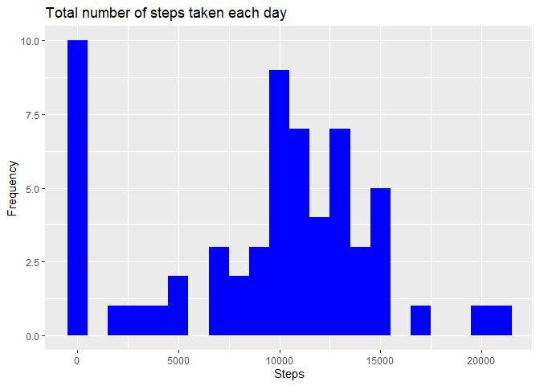
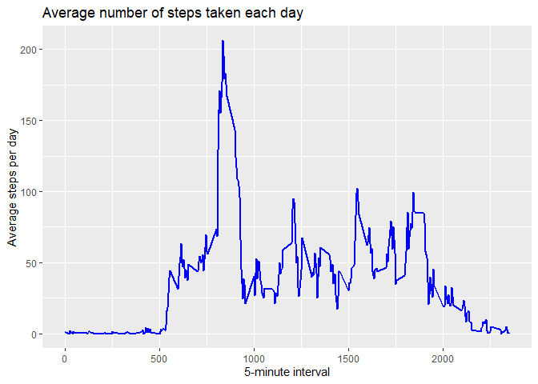
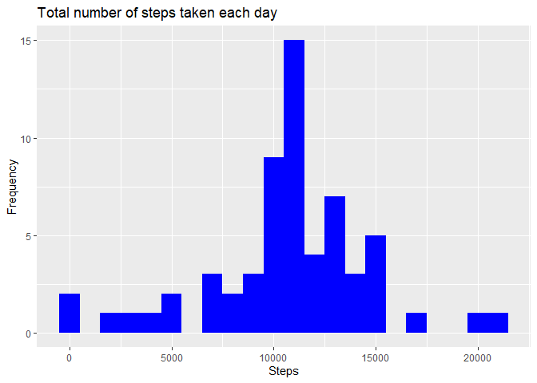
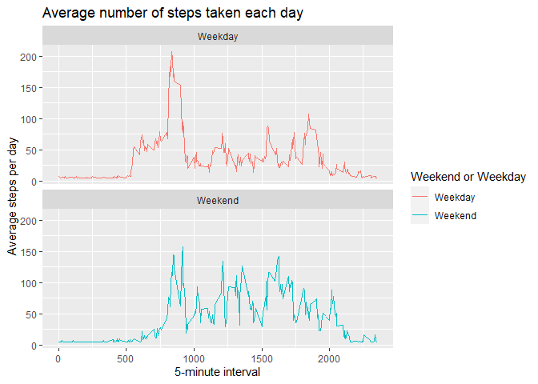

## Loading and preprocessing the data

```r
path <- setwd('/Users/huaig/Desktop/Nick/Coding/Coursera/Johns Hopkins University/5. Reproducible Research/Project/RepData_PeerAssessment1')
path
```

```
## [1] "C:/Users/huaig/Desktop/Nick/Coding/Coursera/Johns Hopkins University/5. Reproducible Research/Project/RepData_PeerAssessment1"
```

```r
library(data.table)
library(ggplot2)

unzip('activity.zip', exdir = 'data')
activity_dt <- data.table::fread(input = 'data/activity.csv')
```

## What is mean total number of steps taken per day?
1. Calculate the total number of steps taken per day

```r
total_steps <- activity_dt[, c(lapply(.SD, sum, na.rm = T)), .SDcols = c('steps'), by = .(date)]
head(total_steps)
```

```
##          date steps
## 1: 2012-10-01     0
## 2: 2012-10-02   126
## 3: 2012-10-03 11352
## 4: 2012-10-04 12116
## 5: 2012-10-05 13294
## 6: 2012-10-06 15420
```

2. Make a histogram of the total number of steps taken each day

```r
ggplot(total_steps, aes(x = steps)) + geom_histogram(binwidth = 1000, fill = 'blue') + labs(x = 'Steps', y = 'Frequency', title = 'Total number of steps taken each day')
```

<!-- -->

3. Calculate and report the mean and median of the total number of steps taken per day

```r
total_steps[, .(mean_steps = mean(steps, na.rm = T), median_steps = median(steps, na.rm = T))]
```

```
##    mean_steps median_steps
## 1:    9354.23        10395
```

## What is the average daily activity pattern?
1. Make a time series plot (i.e. type = "l") of the 5-minute interval (x-axis) and the average number of steps taken, averaged across all days (y-axis)

```r
interval_dt <- activity_dt[, c(lapply(.SD, mean, na.rm = T)), .SDcols = c('steps'), by = .(interval)]
ggplot(interval_dt, aes(x = interval, y = steps)) + geom_line(color = 'blue', size = 1) + labs(x = '5-minute interval', y = 'Average steps per day', title = 'Average number of steps taken each day')
```

<!-- -->

2. Which 5-minute interval, on average across all the days in the dataset, contains the maximum number of steps?

```r
interval_dt[steps == max(steps), .(max_step_interval = interval)]
```

```
##    max_step_interval
## 1:               835
```

## Imputing missing values
1. Calculate and report the total number of missing values in the dataset (i.e. the total number of rows with NAs)

```r
nrow(activity_dt[is.na(steps),])
```

```
## [1] 2304
```

2. Filling in all of the missing values with mean in the dataset

```r
activity_dt[is.na(steps), 'steps'] <- activity_dt[, c(lapply(.SD, mean, na.rm = T)), .SDcols = c('steps')]
```

```
## Warning in `[<-.data.table`(`*tmp*`, is.na(steps), "steps", value =
## structure(list(: 37.382600 (type 'double') at RHS position 1 truncated
## (precision lost) when assigning to type 'integer' (column 1 named 'steps')
```

3. Create a new dataset that is equal to the original dataset but with the missing data filled in

```r
data.table::fwrite(x = activity_dt, file = 'data/activity_new.csv', quote = F)
```

4. Make a histogram of the total number of steps taken each day and Calculate and report the mean and median total number of steps taken per day

```r
total_steps <- activity_dt[, c(lapply(.SD, sum)), .SDcols = c('steps'), by = .(date)]
ggplot(total_steps, aes(x = steps)) + geom_histogram(binwidth = 1000, fill = 'blue') + labs(x = 'Steps', y = 'Frequency', title = 'Total number of steps taken each day')
```

<!-- -->

```r
total_steps[, .(mean_steps = mean(steps), median_steps = median(steps))]
```

```
##    mean_steps median_steps
## 1:   10751.74        10656
```

Estimate methodology | Mean steps | Median steps
--- | --- | ---
1st part (with na) | 9354.23 | 10395
2nd part (imputing na with mean) | 10751.74 | 10656

## Are there differences in activity patterns between weekdays and weekends?
1. Create a new factor variable in the dataset with two levels – “weekday” and “weekend” indicating whether a given date is a weekday or weekend day

```r
activity_dt[, date := as.POSIXct(date, format = '%Y-%m-%d')]
activity_dt[, `Day of the week` := weekdays(x = date)]
activity_dt[grepl(pattern = 'Sunday|Saturday', x = `Day of the week`), 'Weekend or Weekday'] <- 'Weekend'
activity_dt[grepl(pattern = 'Monday|Tuesday|Wednesday|Thursday|Friday', x = `Day of the week`), 'Weekend or Weekday'] <- 'Weekday'
activity_dt[, `Weekend or Weekday` := as.factor(`Weekend or Weekday`)]
head(activity_dt)
```

```
##    steps       date interval Day of the week Weekend or Weekday
## 1:    37 2012-10-01        0          Monday            Weekday
## 2:    37 2012-10-01        5          Monday            Weekday
## 3:    37 2012-10-01       10          Monday            Weekday
## 4:    37 2012-10-01       15          Monday            Weekday
## 5:    37 2012-10-01       20          Monday            Weekday
## 6:    37 2012-10-01       25          Monday            Weekday
```

2. Make a panel plot containing a time series plot (i.e. type = "l") of the 5-minute interval (x-axis) and the average number of steps taken, averaged across all weekday days or weekend days (y-axis)

```r
interval_dt <- activity_dt[, c(lapply(.SD, mean, na.rm = T)), .SDcols = c('steps'), by = .(interval, `Weekend or Weekday`)]
ggplot(interval_dt, aes(x = interval, y = steps, color = `Weekend or Weekday`)) + geom_line() + labs(x = '5-minute interval', y = 'Average steps per day', title = 'Average number of steps taken each day') + facet_wrap(~`Weekend or Weekday`, ncol = 1, nrow = 2)
```

<!-- -->
